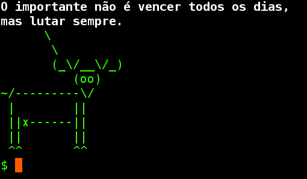

# alce
### Sobre
Alce foi criado para ser uma alternativa mais simples e RÁPIDA do aplicativo cowsay
Feito totalmente em shell utilizando uma lista de mensagens, qualquer pessoa comum pode adicionar novas frases caso assim desejar, conhecendo o minímo de programação em Shell.


### Deixe mais legal
Para o Alce ser executado sempre ao iniciar um novo processo/Shell faça a chamada do mesmo em seu **.bashrc**<br>
Você pode desejar adicionar o alce em seu Home ou em /usr/bin/alce


### Imagens



### Faça você mesmo
```bash
git clone https://notabug.org/jeffersonrocha/alce.git
sudo mv alce/alce /bin/alce
sudo chmod +x /bin/alce
echo "alce" >> ~/.bashrc
```